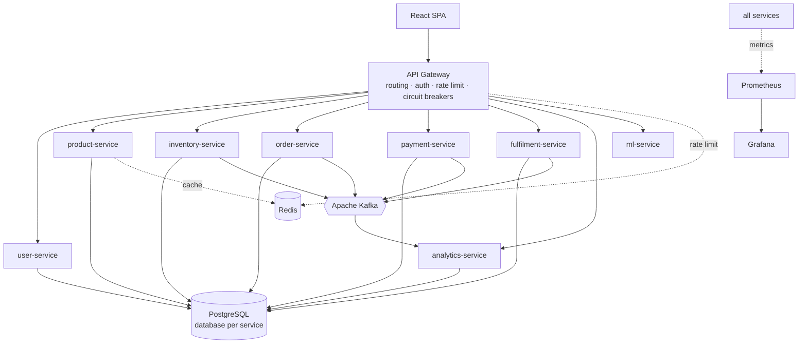
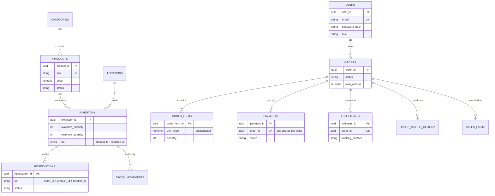

# RetailPulse

**A distributed retail inventory, order and demand-intelligence platform.**

Nine independently deployable services behind an API gateway, communicating
synchronously over REST and asynchronously over Kafka, with PostgreSQL for
transactional data, Redis for caching and rate limiting, Kubernetes manifests
for deployment, Prometheus and Grafana for observability, and a machine-learning
service that forecasts demand and drives replenishment decisions.

> **Every number in this README is measured.** Counts come from
> `scripts/collect_metrics.py`; model accuracy comes from
> `ml/artifacts/metrics_v1.json`, written by the training run. Where something
> has not been measured yet, it says so rather than carrying an estimate.

---

## 1. What problem does it solve?

A retailer holding stock across several stores has to answer three questions at
once, and they pull against each other:

1. **Can I sell this right now?** Stock must be accurate to the unit. Two
   customers buying the last item at the same instant must not both succeed.
2. **What happens when a step fails?** Payment declines, warehouses run out,
   services restart. An order half-way through must not strand stock or charge
   a customer for something that never ships.
3. **What should I order next week?** Too little stock loses sales; too much
   ties up capital.

RetailPulse answers all three: transaction-safe inventory reservation, a saga
with explicit compensation, and a demand forecast that beats a naive baseline.

---

## 2. Measured metrics

| Metric | Value |
|---|---|
| Microservices | **9** |
| REST endpoints | **72** |
| Database tables | **20** |
| Kafka topics | **14** (+ 3 dead-letter) |
| Automated tests | **625** |
| Lines of Python | **23,654** |
| Lines of JS/JSX | **2,241** |
| Lines of YAML | **3,873** |
| Kubernetes objects | **59** |
| Git commits | **35** |

**Demand forecasting** (held-out test period, 2024-01-01 → 2025-12-30 dataset):

| | MAE | RMSE | R² |
|---|---|---|---|
| Gradient boosting model | **14.83** | **21.30** | 0.980 |
| Baseline (*"next week = last week"*) | 19.17 | 28.66 | 0.965 |
| Baseline (*same weekday × 7*) | 41.27 | 61.55 | 0.837 |

**22.65% lower MAE than the naive baseline.** An error figure without a
baseline says nothing about whether a model earns its existence.

> R² of 0.98 looks flattering and is: demand varies enormously *between*
> products and stores, so predicting the general level is easy. The
> MAE-versus-baseline comparison is the honest measure.

**Two other measurements worth quoting:**

- **Rate limiter atomicity.** A naive check-then-increment limiter admitted
  **24 requests against a limit of 20** under 50 concurrent threads. The Lua
  implementation admitted **exactly 20**.
- **Frontend payload.** Route-level code splitting cut the initial JS bundle
  from **194 kB to 81.5 kB gzipped** (58% less) by keeping Recharts out of the
  bundle customers download.

### Not yet measured

These need the full stack running and are deliberately blank rather than
estimated:

- API latency (P50 / P95 / P99) and requests per second — `load-tests/locustfile.py`
- Docker image sizes
- Test coverage percentage

---

## 3. Architecture



Full reasoning — including the costs of each decision — is in
**[`docs/system-design.md`](docs/system-design.md)**.

---

## 4. Technology stack

| Layer | Choice | Why |
|---|---|---|
| Services | FastAPI, Pydantic v2 | Async, and request/response validation is the framework's job |
| Persistence | PostgreSQL 16, SQLAlchemy 2, Alembic | `SELECT … FOR UPDATE` is what makes overselling impossible; migrations are versioned and reversible |
| Cache | Redis 7 | Cache-aside for hot reads; sliding-window rate limiting in Lua |
| Events | Kafka 3.7 (KRaft) | Decouples the order saga in time; no ZooKeeper to operate |
| Frontend | React 18, Vite, Recharts | Code-split so customers never download the charting library |
| ML | scikit-learn, pandas | Gradient boosting; the problem does not need deep learning |
| Deployment | Docker, Kubernetes | Multi-stage builds, non-root, HPA, probes, network policy |
| Observability | Prometheus, Grafana | RED metrics plus business metrics and alert rules |
| CI/CD | GitHub Actions, Trivy, Gitleaks | Tests, image builds, four kinds of security scanning |

---

## 5. Services

| Service | Port | Owns |
|---|---|---|
| `api-gateway` | 8000 | Routing, token verification, rate limiting, circuit breakers |
| `product-service` | 8001 | Catalog, categories, search, Redis cache |
| `inventory-service` | 8002 | Multi-location stock, reservations, stock ledger |
| `order-service` | 8003 | Cart, orders, the order state machine, outbox |
| `user-service` | 8004 | Accounts, JWT issuance, RBAC, audit log |
| `payment-service` | 8005 | Simulated payments, refunds |
| `fulfilment-service` | 8006 | Shipments, tracking, delivery attempts |
| `analytics-service` | 8007 | Sales read model, aggregation pipeline |
| `ml-service` | 8008 | Demand forecasting, replenishment advice |

Five services also run a **separate worker process** consuming Kafka. The API
scales on request latency, a consumer on partition count and lag — sharing a
process would mean scaling the web tier to clear a backlog.

---

## 6. Database schema



Relationships across service boundaries (`orders → products`) are **application
level, not foreign keys** — the tables live in different databases. Within a
service, constraints do the enforcing: `available_quantity >= 0`, one payment
per order, one reservation per `(order, product, location)`.

Every consuming service also has `processed_events` and `outbox_events`.

---

## 7. Kafka architecture

14 business topics plus 3 dead-letter topics. Every order-related event is
**keyed by `order_id`**, so all events for one order land on the same partition
and are processed in order.

```
order.created → inventory.reserved → payment.requested
   → payment.confirmed → order.confirmed → fulfilment.started
   → order.shipped → order.delivered

failure branch:
   payment.failed → inventory.released → order.cancelled
```

**Idempotency.** Kafka delivers at least once, so consumers deduplicate on a
`processed_events` table with `PRIMARY KEY (event_id, consumer_group)`, written
in the *same transaction* as the side effects. The group is part of the key
because fulfilment and analytics both consume `ORDER_CONFIRMED`.

**Retries and DLQ.** Bounded retries with capped exponential backoff. Permanent
failures (malformed payloads) skip retries entirely rather than blocking a
partition behind a message that can never succeed. Exhausted events are
dead-lettered with their failure context, replayable verbatim.

**The dual-write problem.** Events are staged in a **transactional outbox**
written with the business data, then relayed. A crash between committing an
order and publishing its event would otherwise leave an order nothing
downstream ever hears about.

---

## 8. Caching

Cache-aside on product lookups and the category list.

**Delete on write, never update.** Overwriting races: two concurrent updates
can reach Postgres in one order and Redis in the other, leaving the cache
permanently wrong. Deleting has no ordering problem.

**Redis is never the source of truth.** If it is unavailable, every read falls
through to Postgres. A cache outage costs latency, not availability — enforced
in the shared helper every caller goes through.

Search results and paginated listings are deliberately **not** cached: search
has an unbounded key space, and listings go stale whenever any product changes.

---

## 9. ML pipeline

```
synthetic history → feature engineering → time-split → gradient boosting
       ↓                    ↓                  ↓              ↓
  109,500 rows      leakage-guarded      gap between    MAE vs baseline
  30 products       lags & rollings      train/test     (gate: must beat it)
  5 stores
```

**Target:** total units sold over the next 7 days. Direct multi-horizon, not
recursive — feeding predictions back compounds error and requires inventing
future lag values.

**Leakage guards.** Lags computed within each `(product, store)` group; rolling
windows ending at day *t*; a chronological split with a gap so no training row's
target reaches into the test period. Plus an empirical check: **a model trained
on shuffled targets must collapse to no skill** — if any feature secretly held
the answer, it would still score well.

### A measured limitation

The model's edge is **not** monotonic in training data:

| History | Test window | vs baseline |
|---|---|---|
| 180 days | May–Jun | **+10.8%** |
| 270 days | Aug–Sep | **+22.5%** |
| 300 days | Sep–Oct | **−33.4%** |
| 365 days | Nov–Dec | **−14.9%** |
| 730 days | Nov–Dec | **+19.9%** |

The two negatives are the windows crossing the festive season. **A model
trained on under a year has never observed October and cannot extrapolate it**,
so during a seasonal regime change it does *worse* than a naive baseline that
simply tracks the recent level. With a second year covering the same months, it
wins by 20%.

That is why the shipped model trains on two years — and both cases are pinned
by tests so a future change that appears to "fix" short-history performance
gets examined rather than trusted.

---

## 10. Security

- **Passwords** bcrypt-hashed (cost 12). The cost factor is configurable only
  under `ENVIRONMENT=test`, guarded so a misconfiguration cannot weaken it.
- **JWT** verified locally by each service — no shared session store, no
  network call per request. The trade-off is stated: a token cannot be revoked
  before expiry, so lifetimes are short.
- **Authorization is server-side, everywhere.** The frontend hides links for
  usability; every hidden link points at an endpoint the server refuses anyway.
- **No account enumeration.** Unknown email and wrong password return an
  identical 401, and the unknown-email path still runs a bcrypt verify so
  response timing does not leak either.
- **Ownership leaks nothing.** Requesting another customer's order returns
  **404, not 403** — confirming an ID exists is itself information.
- **SQL injection** prevented by parameterised ORM queries throughout; LIKE
  wildcards in search input are escaped.
- **Secrets** only from environment variables. No credential is committed;
  CI scans full git history with Gitleaks.
- **Containers** run as a non-root user with a read-only root filesystem and
  all capabilities dropped.
- **Trivy** scans images and the filesystem in CI.

---

## 11. Testing

**625 automated tests.**

| Suite | Tests |
|---|---|
| order-service | 113 |
| product-service | 80 |
| retailpulse_common | 74 |
| inventory-service | 74 |
| api-gateway | 60 |
| payment-service | 44 |
| user-service | 42 |
| ml | 38 |
| analytics-service | 35 |
| fulfilment-service | 33 |
| ml-service | 32 |

Tests that need real infrastructure are marked and run separately:

- **`-m postgres`** — concurrency tests with real threads. `SELECT … FOR UPDATE`
  is a *no-op on SQLite*, so a SQLite-only suite would pass with the oversell
  bug fully intact.
- **`-m kafka`** — partition-key ordering and DLQ replay against a real broker.
- **`-m redis`** — rate-limiter atomicity under 50 concurrent threads.

**Two suites were verified non-vacuous by breaking the code on purpose:**
removing the row lock makes the conservation test fail; a naive rate limiter
over-admits.

---

## 12. Performance

*Pending measurement.* The harness is written
(`load-tests/locustfile.py`, 100 concurrent users, browse-weighted mix) but has
not been run, so no figures are quoted here.

```bash
locust -f load-tests/locustfile.py --host http://localhost:8000 \
       --headless --users 100 --spawn-rate 10 --run-time 5m
```

The run exits non-zero above 1% failures or 1s P95, so it can gate a release.

---

## 13. Running it

```bash
git clone https://github.com/Ameya041/retailpulse.git
cd retailpulse
cp .env.example .env          # then edit JWT_SECRET_KEY

docker compose up -d          # 22 containers
```

| Surface | URL |
|---|---|
| Frontend | http://localhost:3000 |
| API gateway | http://localhost:8000/docs |
| Grafana | http://localhost:3001 |
| Prometheus | http://localhost:9090 |

Local development without containers:

```powershell
.\scripts\dev.ps1 setup      # venv + dependencies
.\scripts\dev.ps1 infra      # postgres, redis, kafka
.\scripts\dev.ps1 migrate
.\scripts\dev.ps1 test
.\scripts\dev.ps1 run product-service
```

Train the model:

```bash
python ml/generate_dataset.py --days 730
python ml/train.py            # exits non-zero if it loses to the baseline
```

---

## 14. Deployment

**Docker.** Multi-stage builds (no compiler in the runtime image), non-root
user, exec-form `CMD` so `SIGTERM` reaches the process — which the Kafka
consumers need to finish the message they are holding.

**Kubernetes.** 59 objects: Deployments, Services, ConfigMap, Secret, HPA,
Ingress, NetworkPolicy, PodDisruptionBudgets, and a migration Job.

- **Liveness checks the process only**; readiness checks dependencies.
  Conflating them means a Redis blip restarts every pod.
- **Migrations run as a Job**, not at startup, where N replicas would race to
  apply the same DDL.
- **HPA targets 70% CPU**, not 90% — scale-up takes time and the trigger needs
  headroom. Workers get no HPA: parallelism is capped by partition count.
- **Default-deny network policy.** Services authorize every request anyway;
  there is no reason for them to be reachable in the first place.

```bash
kubectl apply -f k8s/
python scripts/validate_k8s.py   # offline manifest validation
```

---

## 15. Monitoring

Every service exposes `/metrics`. Route labels use the **template**
(`/products/{product_id}`), not the raw path — otherwise every UUID becomes its
own time series.

Beyond RED metrics, business metrics are tracked: orders created/completed/
failed, inventory reservations and failures, Kafka events produced/processed/
duplicated/dead-lettered, cache hit ratio.

Alert rules are written against **symptoms, not causes**. High CPU is sometimes
exactly what you want; checkout failing never is. Includes an alert for *zero
orders in 30 minutes* — the case where every service looks healthy and the
checkout button is broken.

*Grafana screenshots pending — they require the running stack.*

---

## 16. Future improvements

- **A modular monolith first.** Most of this machinery exists to solve problems
  distribution introduced. Same boundaries, one deployable, split only where
  scaling demanded it.
- **Contract testing** between services — nothing currently catches a producer
  changing an event's shape until a consumer fails at runtime.
- **Distributed tracing** (OpenTelemetry + Jaeger). `correlation_id` threads
  through every event and log line, but reconstructing a trace still means
  grepping.
- **A real feature store** — the ML service reads a history snapshot.
- **Schema registry** for events; the envelope is versioned by convention.
- **CDC instead of outbox polling** at higher throughput.
- **PgBouncer** — connection exhaustion is the first bottleneck to bite.

See [`docs/system-design.md`](docs/system-design.md) §16–18 for what changes at
10× and 100× traffic.

---

## Repository layout

```
services/          9 microservices, each with app/, tests/, alembic/, Dockerfile
libs/              retailpulse_common — config, db, auth, events, cache, observability
ml/                dataset generation, feature engineering, training, model tests
frontend/          React SPA
k8s/               Kubernetes manifests (+ templates and a generator)
infra/             Dockerfiles, nginx, Prometheus, Grafana provisioning
load-tests/        Locust harness
scripts/           dev runner, topic creation, metrics, validation
docs/              system design
.github/workflows/ ci, docker, security
```
