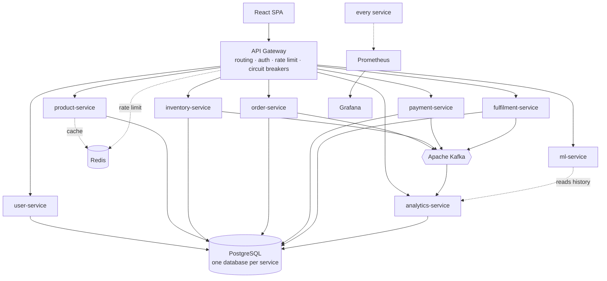
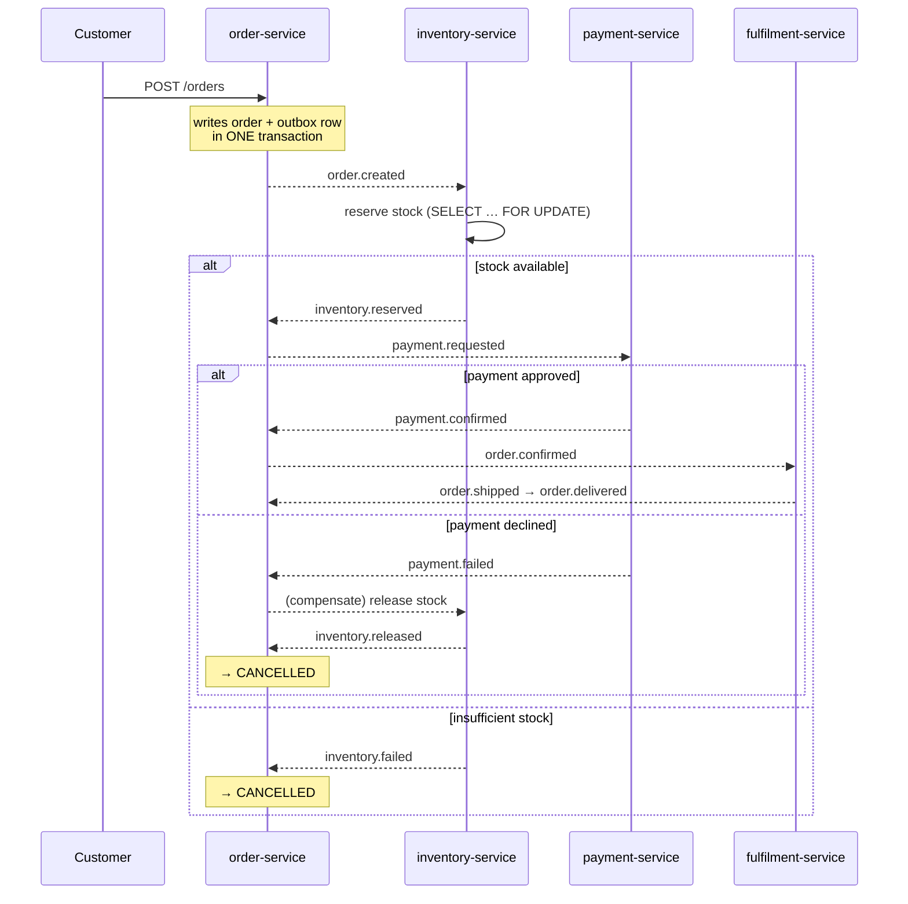

# RetailPulse — System Design

This document explains **why** the system is built the way it is. Where a
decision has a real cost, the cost is stated rather than hidden — a design
document that only lists benefits is marketing.

---

## 1. Architecture



### The order saga



---

## 2. Why microservices?

**The honest answer first: for a system this size, a monolith would be
simpler.** One deployable, one database, real foreign keys, no eventual
consistency, no saga. Splitting into nine services buys independent scaling and
independent deployment, and costs a great deal of machinery to get right.

The split is justified because the domains have genuinely different
characteristics:

| Domain | Why it differs |
|---|---|
| Catalog | Read-heavy by orders of magnitude; benefits from aggressive caching |
| Inventory | Write-heavy and contended; correctness under concurrency is the whole problem |
| Orders | Long-lived state machine spanning minutes to days |
| Analytics | Large scans that must never touch the checkout database |
| ML | CPU and memory bound, completely different scaling profile |

Inventory reservations and catalog browsing genuinely do not want the same
resources. That is the argument — not "microservices are modern".

**Boundaries follow data ownership.** Each service is the only writer of its
tables. Nothing reaches into another service's database, which is what makes
independent deployment real rather than nominal.

---

## 3. Why PostgreSQL?

Orders and inventory are transactional, relational, and full of invariants a
database can enforce better than application code can:

- `available_quantity >= 0` as a CHECK constraint
- one payment per order as a UNIQUE index
- `orders → order_items` as a real foreign key

**The key property is `SELECT … FOR UPDATE`.** The oversell problem (§5) is
solved by row-level locking inside a transaction. A store without that would
need a different and worse solution.

**Database-per-service, one instance.** Each service owns a separate logical
database, so a cross-service join is impossible to write. Locally they share
one Postgres instance because running nine would exhaust a laptop; in
production each would move to its own managed instance. The isolation that
matters — no service can read another's tables — holds either way.

---

## 4. Why Redis?

Product lookups are the hottest read in the system and change rarely.

**Cache-aside, and delete on write — never update.** Writing the new value into
the cache races: two concurrent updates can reach Postgres in one order and
Redis in the other, leaving the cache permanently disagreeing with the
database. Deleting has no ordering problem; the next read repopulates from
whatever Postgres actually holds. The cost is one extra miss.

**Redis is never the source of truth.** Every cached value is rebuildable from
Postgres, which is what makes the failure policy safe: if Redis is down, every
read falls through to the database. A cache outage costs latency, not
availability. That guarantee is enforced in the shared helper every caller goes
through, not in each backend, so a new backend cannot silently opt out.

Redis also backs rate limiting (§9).

---

## 5. How does inventory consistency work?

**The problem.** Two customers order the last unit simultaneously. The naive
implementation reads `available = 1`, both check `>= 1`, both write `0`. Two
units sold, one existed. This is a lost update, and it is invisible in testing
because it only appears under concurrency.

**The fix.** Every quantity change takes a row-level exclusive lock first:

```sql
SELECT … FROM inventory WHERE … FOR UPDATE
```

The second transaction blocks until the first commits, then re-reads the
updated value and correctly fails. Postgres serialises the two requests on
exactly the rows involved, so throughput stays high.

**Why not optimistic locking?** A version column with retry works, but under
contention for a hot product every retry is wasted work, and the retry loop is
another thing to get wrong. Pessimistic locking on a short transaction is
simpler, and the lock is held for microseconds.

**Why not rely on the CHECK constraint alone?** It prevents the bad write but
surfaces as an `IntegrityError` after the fact. The lock lets the service
return a clean 409 with the actual available quantity, which the order service
needs in order to explain the failure.

**Deadlock avoidance.** An order touching several products locks several rows.
If order A locks (P1, P2) while order B locks (P2, P1), they deadlock. Every
lock is therefore acquired ordered by `inventory_id`, so all transactions walk
the rows in the same sequence and a cycle cannot form.

**All-or-nothing.** If line 3 of a 5-line order cannot be satisfied, the whole
transaction rolls back. A partially reserved order strands stock and leaves the
customer in a state no downstream service knows how to resolve.

**This is verified, not asserted.** Concurrency tests run real threads against
real Postgres: 20 threads race for 1 unit and exactly one wins. Removing the
lock makes them fail — measured, not assumed.

---

## 6. Why Kafka?

Order, inventory, payment and fulfilment are coupled in sequence but not in
time. Synchronous HTTP would mean a checkout request held open while payment
and fulfilment complete, and any one service being down would fail the whole
order.

Kafka decouples them: the order service publishes and returns. If payment is
down, events queue and are processed when it recovers.

**Partitioning.** Every order-related event is keyed by `order_id`. Kafka
guarantees ordering only *within* a partition, and equal keys always hash to
the same partition — so all events for one order are processed in the order
they were emitted. Without this, `INVENTORY_RESERVED` could overtake the
`ORDER_CREATED` that caused it.

---

## 7. The dual-write problem

Creating an order means two writes to two systems: a row in Postgres and a
message in Kafka. No transaction spans both.

*Publish first, then commit* — if the commit fails, downstream services reserve
stock for an order that does not exist.

*Commit first, then publish* — if the publish fails, the order exists but
nothing downstream hears about it. It sits in `CREATED` forever. This is the
more common failure and the more insidious one, because everything looks fine
until a customer complains.

**A try/except does not fix it.** The process can be SIGKILLed between the two
statements, and no exception handler runs for that.

**The fix: a transactional outbox.**

```sql
BEGIN;
  INSERT INTO orders …;
  INSERT INTO outbox_events …;
COMMIT;
```

One write, one system, atomic. A relay polls the outbox and publishes. If it
crashes mid-flight, the row is still unpublished and is picked up next pass —
so an event may be published more than once, which is fine because every
consumer deduplicates (§8).

**Cost, stated plainly:** added latency (published on the next poll, not
instantly) and a process to operate. The alternative at larger scale is
change-data capture reading the write-ahead log directly (Debezium), which
removes the polling but adds much heavier infrastructure.

---

## 8. How are duplicate events handled?

Kafka gives **at-least-once** delivery. A consumer that crashes after doing its
work but before committing its offset sees the same event again. Rebalances
cause the same. This is normal operation, not an edge case.

**Why not exactly-once?** Kafka's transactional exactly-once does not extend to
a Postgres write in another system, which is where the side effects land. So
delivery stays at-least-once and the *effect* is made idempotent instead.

**The mechanism.** A `processed_events` row is written **inside the same
transaction as the handler's side effects**:

```
PRIMARY KEY (event_id, consumer_group)
```

Either both commit or neither does. The primary key does the enforcing — not an
application-level "have I seen this?" check, which reads then writes and races
with another consumer between the two steps.

`consumer_group` is part of the key because different services legitimately
process the same event: fulfilment and analytics both consume
`ORDER_CONFIRMED`, and neither should suppress the other.

**Defence in depth.** Business-level unique constraints back this up:
`payments.order_id`, `fulfilments.order_id`, and
`(order_id, product_id, location_id)` on reservations. When the failure mode is
"customer charged twice", the guarantee belongs in the database.

---

## 9. Rate limiting

A **fixed window** ("100/minute") lets a caller send 200 requests in two
seconds by straddling the boundary. A **sliding window log** keeps a timestamp
per request and is exact.

**Evaluated atomically in Lua.** Check-then-increment is a read followed by a
write: two concurrent requests both read 99, both decide they are under the
limit, and the 101st succeeds. This is the same lost-update race as the
inventory oversell, in a different costume. Measured: the naive version
admitted **24 requests against a limit of 20**; the Lua version admitted
exactly 20.

**Fails open.** If Redis is unavailable the limiter allows the request. That is
a real trade-off: an attacker who can take Redis down bypasses limiting. The
alternative — failing closed — means a Redis outage takes the whole API
offline. For a storefront, availability wins. A system where the limiter is the
*primary* defence against abuse should choose differently.

---

## 10. What happens when payment fails?

A saga cannot roll back a committed transaction in another service, so failure
is handled by **compensation** — an explicit inverse operation:

```
INVENTORY_RESERVED → PAYMENT_FAILED → INVENTORY_RELEASED → CANCELLED
```

The state machine **requires** passing through `INVENTORY_RELEASED` before
`CANCELLED`. Skipping it would strand held stock forever, so the transition
graph makes that shortcut impossible rather than relying on every handler
remembering.

**Declines and outages are different.** A decline is an *answer*: recorded,
published as `PAYMENT_FAILED`, acknowledged. An outage is *no answer*: it
propagates so the consumer retries with backoff, and nothing is written so the
retry starts clean. Conflating them gives either infinite retries on a declined
card, or a provider outage reported to the customer as a refusal.

---

## 11. Order state machine

Status is a node in an explicit directed graph, not a mutable string. Every
change goes through one validation layer.

- **Terminal states are absorbing.** `DELIVERED` and `CANCELLED` have no
  outgoing edges, so a late duplicate event cannot resurrect a finished order.
- **Cancellation is only legal before fulfilment.** Once a parcel is with a
  carrier, undoing it is a returns process, not a status change.
- **Re-applying the current status is an idempotent no-op**, not an error —
  because Kafka will redeliver.

Small enough to test exhaustively: all 100 `(from, to)` pairs are checked,
plus graph properties (every status reachable, every status can reach a
terminal state, no self-edges).

---

## 12. Failure handling summary

| Failure | Response |
|---|---|
| Database unreachable | Readiness fails; pod leaves the load balancer without restarting |
| Redis unreachable | Cache reads fall through to Postgres; limiter fails open |
| Kafka unreachable | Outbox retains events; relay retries with a bounded attempt count |
| Downstream service down | Circuit breaker opens; requests fail fast instead of queueing |
| Event cannot be processed | Bounded retries with capped backoff, then dead-lettered |
| Malformed event | Dead-lettered immediately — retrying cannot fix a bad payload |
| Payment declined | Compensating stock release, order cancelled |
| Duplicate event | Suppressed by `processed_events`, offset committed |

**Liveness vs readiness.** Liveness answers "is this process alive?" and must
never check dependencies — if it did, a Redis blip would restart every pod,
turning a degraded dependency into a full outage. Readiness answers "can this
pod serve traffic?" and does check them.

---

## 13. How does the system scale?

**Stateless services scale horizontally** because they hold no in-memory
session, no local disk, and every request is self-contained. Adding a replica
is safe precisely because of that. A service keeping per-user state in memory
could not be scaled this way without sticky sessions.

HPA targets **70% CPU, not 90%** — scale-up takes time (schedule, pull, start,
pass readiness) and the trigger must leave headroom to absorb load meanwhile.
Scale-down is deliberately slow to avoid thrashing.

**Workers scale differently.** A Kafka consumer's useful parallelism is capped
by partition count: replicas beyond it sit idle. They get no HPA.

**Why order-service can scale.** It writes only its own database, holds no
session, and its events are keyed so ordering survives. Two replicas processing
different orders never interact.

---

## 14. Bottlenecks

In the order they would bite:

1. **Postgres connections.** Each replica holds a pool; `max_connections` is
   the real ceiling. Fixed with PgBouncer, not with more replicas.
2. **Inventory row contention.** A single viral product serialises on one row.
   Sharding stock across locations spreads it; a true single-SKU flash sale
   needs a queue.
3. **The outbox relay.** Polling caps event throughput. CDC removes it.
4. **Catalog search.** `LIKE` scans are fine at thousands of rows and fall over
   at millions — that is when a trigram index or a search engine earns its cost.
5. **The gateway.** One process proxying everything; horizontally scalable, but
   it is a shared failure domain.

---

## 15. Consistency guarantees

| Boundary | Guarantee |
|---|---|
| Within one service | **Strong.** ACID transactions, enforced constraints |
| Inventory reservation | **Strong and serialised.** Row locks; overselling is impossible |
| Across services | **Eventual.** Typically sub-second; bounded by relay poll + consumer lag |
| Event processing | **Effectively-once.** At-least-once delivery + idempotent consumers |
| Analytics | **Eventually consistent.** A read model rebuilt from events |

The user-visible consequence: an order may briefly show `CREATED` before moving
to `INVENTORY_RESERVED`. That is the honest cost of not using a distributed
transaction, and it is why the order detail page shows the transition history.

---

## 16. What changes at 10× traffic?

- **PgBouncer** in front of Postgres — connection exhaustion arrives first
- **Read replicas** for the catalog and analytics
- **More Kafka partitions** (must be planned: increasing them changes key-to-partition mapping)
- **CDC instead of outbox polling**
- **Redis cluster** rather than a single node
- **Cache the product list**, not just individual products

## 17. What changes at 100× traffic?

- **Separate database instances** per service, not just separate databases
- **Sharding** — orders by customer, inventory by location
- **A real search engine** for the catalog
- **CQRS with materialised read models** for order history
- **Regional deployment**; Kafka geo-replication
- **Reserve inventory in Redis** with periodic reconciliation to Postgres — at
  that scale, row locks on a hot SKU become the wall
- **Cell-based architecture** so one region's failure is contained

The honest note: at 100× nearly every decision here would be revisited. The
value of the current design is that its boundaries are already drawn along the
lines the scaling would follow.

---

## 18. What I would do differently

- **Start with a modular monolith.** Same boundaries, one deployable, split
  only where scaling actually demanded it. Most of this machinery exists to
  solve problems distribution introduced.
- **Contract testing** between services. Nothing currently catches a producer
  changing an event's shape until a consumer fails at runtime.
- **Distributed tracing** (OpenTelemetry). The `correlation_id` threads through
  every event and log line, but reconstructing a trace still means grepping.
- **A real feature store.** The ML service reads a history snapshot; production
  needs features materialised on a schedule.
- **Schema registry** for events. The envelope is versioned by convention, not
  enforced.
